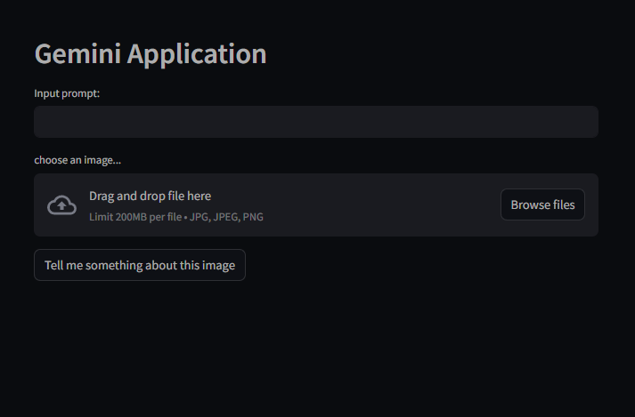
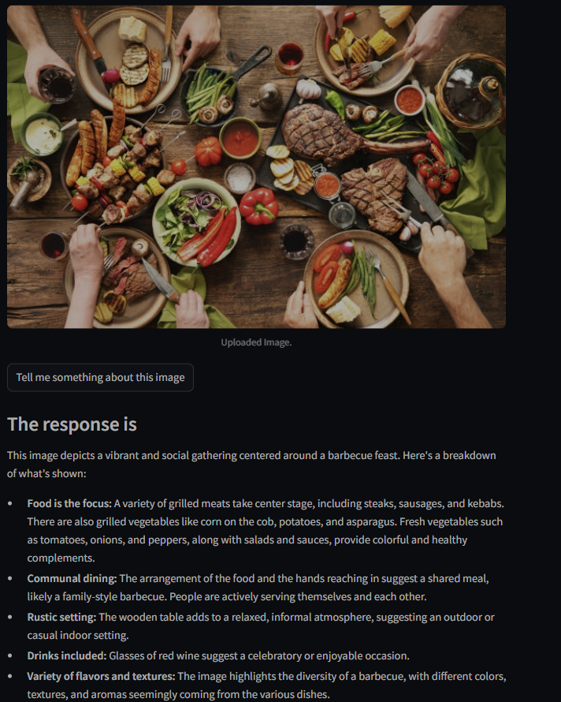

# 🤖 Gemini Chatbot with Streamlit

An interactive chatbot application built with [Streamlit](https://streamlit.io/) and powered by Google's [Gemini API](https://ai.google.dev/). Engage in dynamic conversations and experience the capabilities of advanced language models.

---

## 🚀 Features

- **Conversational AI**: Interact with the Gemini language model for real-time responses.
- **User-Friendly Interface**: Clean and intuitive UI built with Streamlit.
- **Session Management**: Maintains conversation history during user sessions.
- **Secure Configuration**: Utilizes environment variables to manage API keys securely.

---

## 🖼️ Demo





---

# 🛠️ Installation
## Prerequisites
- Python 3.7 or higher
- pip package manager

### Steps

1. **Clone the repository**:

   Open Command Prompt (ideally in VS Code) and run:
```
git clone https://github.com/your-username/gemini-chatbot-streamlit.git
cd gemini-chatbot-streamlit
```

2. **Create a virtual environment**:
```
conda create --name gemini-chatbot python=3.9

```

3. **Activate the virtual environment**:
```
conda activate gemini-chatbot
```

4. **Install the dependencies**:
```
pip install -r requirements.txt
```

5. **Set up environment variables**:

- Create a `.env` file in the project root directory.
- Add your Google Gemini API key to it like this:

  ```
  GOOGLE_API_KEY=your_google_gemini_api_key
  ```

6. **Run the Streamlit application**:
```
streamlit run app.py
```

The application should open in your browser at [http://localhost:8501](http://localhost:8501).

