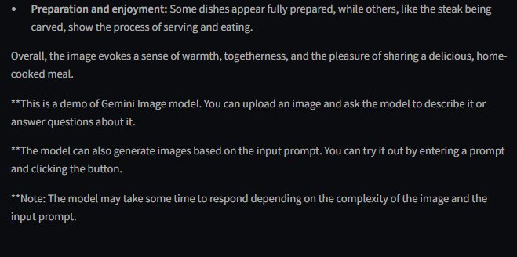

# 🤖 Gemini Chatbot with Streamlit

An interactive chatbot application built with [Streamlit](https://streamlit.io/) and powered by Google's [Gemini API](https://ai.google.dev/). Engage in dynamic conversations and experience the capabilities of advanced language models.

---

## 🚀 Features

- **Conversational AI**: Interact with the Gemini language model for real-time responses.
- **User-Friendly Interface**: Clean and intuitive UI built with Streamlit.
- **Session Management**: Maintains conversation history during user sessions.
- **Secure Configuration**: Utilizes environment variables to manage API keys securely.

---

## 🖼️ Demo




---

# 🛠️ Installation
## Prerequisites
- Python 3.7 or higher
- pip package manager

### Steps

1. **Clone the repository**:

   Open Command Prompt (ideally in VS Code) and run:
```
git clone https://github.com/your-username/gemini-chatbot-streamlit.git
cd gemini-chatbot-streamlit
```

2. **Create a virtual environment**:
```
conda create --name gemini-chatbot python=3.9

```

3. **Activate the virtual environment**:
```
conda activate gemini-chatbot
```

4. **Install the dependencies**:
```
pip install -r requirements.txt
```

5. **Set up environment variables**:

- Create a `.env` file in the project root directory.
- Add your Google Gemini API key to it like this:

  ```
  GOOGLE_API_KEY=your_google_gemini_api_key
  ```

6. **Run the Streamlit application**:
```
streamlit run app.py

```

The application should open in your browser at [http://localhost:8501](http://localhost:8501).

---

## 🔧 Configuration
- **API Key**: Store your Gemini API key in the .env file as GOOGLE_API_KEY.
- **Streamlit Settings**: Optional customization via .streamlit/config.toml.

---

## 🧪 Usage

- Launch the app with streamlit run app.py.
- Enter your queries in the chat input.
- View real-time responses from the Gemini model.
- Session history is preserved during the browser session.

---

## 📈 Roadmap
- [ ] Add user authentication
- [ ] enable persistent session history
- [ ] support mulltiple AI model options
- [ ] Dockerize the application for deployment

---

## 🤝 Contributing

Contributions are welcome!

1. Fork this repository.
2. Create a new branch: git checkout -b feature/your-feature
3. Commit your changes: git commit -m 'Add your feature'
4. Push the branch: git push origin feature/your-feature
5. Submit a pull request 🚀

---

## 📄 License
This project is licensed under the MIT License. See the LICENSE file for details.

---

## 🙏 Acknowledgments
- [Streamlit](https://streamlit.io/)
- [Google Gemini API](https://ai.google.dev/)
- Community tutorials and similar open-source projects for inspiration.
